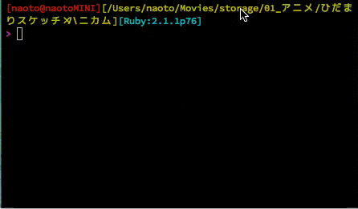

Aircon
===================================================

airplay-cli / file select for peco

Requirements
---------------------------------------------------

- [peco]((https://github.com/peco/peco))
- [airplay](https://github.com/elcuervo/airplay)

Getting started
--------------------

### Installation

```
$ cd /path/to/bin # in $PATH
$ curl -O https://raw.githubusercontent.com/naoto/pecrant/master/aircon
$ chmod +x ./aircon
```

### Usage

```
$ aircon
```



License
--------------------

MIT License.
